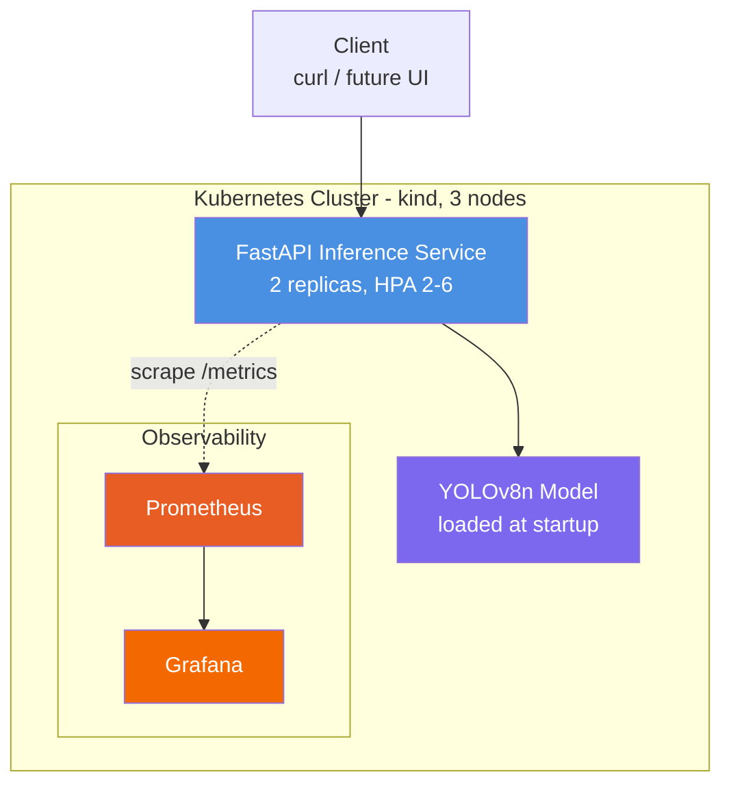

# MLOps Defect Detector

> Kubernetes-native MLOps platform for industrial defect detection.
> Built with FastAPI, YOLOv8, Helm, and production-grade DevOps practices.

[]()
[]()
[]()
[]()

---

## 🎯 What This Is

A defect detection inference platform deployed to Kubernetes, designed for
industrial use cases (automotive QC, textile inspection, electronics manufacturing).

**Why it matters:** Manual quality control is slow and inconsistent. ML-based
defect detection scales, but most tutorials skip the hard parts — production
deployment, observability, autoscaling, GitOps. This project covers the full
stack, not just the model.

## 🏗️ Architecture



**Stack:** Kubernetes (kind), Helm, FastAPI, YOLOv8 (ultralytics), Prometheus
+ Grafana, HPA (CPU-based autoscaling), metrics-server.

## ✅ Current Status

| Phase | Description | Status |
|-------|-------------|--------|
| 1 | Foundation (kind, FastAPI, Helm) | ✅ Complete |
| 2 | Real YOLOv8 inference + production Dockerfile | ✅ Complete |
| 3 | Prometheus + Grafana + HPA | 🚧 In Progress |
| 4 | Azure DevOps CI/CD pipeline | ⏳ Planned |
| 5 | ArgoCD GitOps | ⏳ Planned |
| 6 | Terraform + Azure AKS | ⏳ Planned |
| 7 | MVTec fine-tuning (model v2) | ⏳ Planned |

## 🚀 Quick Start

### Prerequisites

- Docker
- kind ≥ 0.24
- kubectl ≥ 1.31
- Helm ≥ 3.20
- Python 3.12 (for local dev)

### 1. Create the cluster

```bash
kind create cluster --config infra/kind-config.yaml
```

### 2. Build and load the image

```bash
docker build -f services/inference-api/Dockerfile -t defect-api:0.2.1 .
kind load docker-image defect-api:0.2.1 --name defect-cluster
```

The Dockerfile downloads the YOLOv8n model at build time — no Git LFS, no
runtime download. Reproducible builds, fast cold starts.

### 3. Deploy with Helm

```bash
kubectl create namespace defect-system
helm install defect k8s/defect-api -n defect-system --set image.tag=0.2.1
```

### 4. Test

```bash
kubectl port-forward -n defect-system svc/defect-defect-api 8000:8000

# In another terminal
curl http://localhost:8000/ready
curl -X POST -F "file=@/path/to/image.jpg" http://localhost:8000/predict
curl http://localhost:8000/metrics | grep inference_
```

## 📦 Repository Layout

| Path | Purpose |
|------|---------|
| `infra/kind-config.yaml` | 3-node local Kubernetes cluster definition |
| `infra/kube-prometheus-values.yaml` | Monitoring stack customization |
| `k8s/defect-api/` | Helm chart (Deployment, Service, HPA, ServiceAccount) |
| `services/inference-api/main.py` | FastAPI app — endpoints, lifespan, metrics |
| `services/inference-api/model.py` | `DefectDetector` wrapper around YOLOv8 |
| `services/inference-api/Dockerfile` | CPU-only PyTorch, model baked in, non-root |
| `models/` | Model artifacts (gitignored, downloaded at build time) |

## 🔧 Engineering Decisions

**Why these choices were made (and what tradeoffs they involve):**

### Model loading at startup, not per-request
The model lives in memory once the pod is ready. FastAPI's `lifespan` context
manager loads it before traffic arrives. Cold start cost (~8s in cluster) is
paid once; per-request latency drops from seconds to ~800ms.

### Three separate probes (startup / liveness / readiness)
- **Startup probe** gives the container up to 65s to load the model without
  the liveness probe killing it prematurely.
- **Liveness** checks process health on `/health` (no model dependency).
- **Readiness** checks `/ready` which verifies the model is loaded — pod won't
  receive traffic until the model is in memory.

### Build-time model download, not runtime
`RUN python -c "from ultralytics import YOLO; YOLO('yolov8n.pt')"` in the
Dockerfile means the image is self-contained and reproducible. No surprises
when the upstream model URL changes. Tradeoff: rebuilds when the model changes
(rare for production).

### CPU-only PyTorch in the container
The cluster has no GPU. Shipping CUDA libraries would add ~1.5GB for nothing.
`--index-url https://download.pytorch.org/whl/cpu` gives us a leaner image.
GPU training (when added) will run on host, not in cluster.

### v1 model is COCO-pretrained, not fine-tuned
This is **deliberate**. Phase 2's goal was to validate the inference pipeline
end-to-end with a real model. Fine-tuning on MVTec AD is its own phase
(planned). Shipping a heuristic v1 lets the rest of the platform be built
and tested while training data is prepared.

## 📊 Metrics Exposed

Available at `/metrics`:

| Metric | Type | Purpose |
|--------|------|---------|
| `inference_requests_total` | Counter | Request volume by endpoint/status |
| `inference_duration_seconds` | Histogram | Latency distribution |
| `inference_active_requests` | Gauge | Concurrent in-flight requests |
| `defects_detected_total` | Counter | Defect counts by type |
| `model_load_duration_seconds` | Gauge | Time to load model at startup |

Pods are annotated for Prometheus scraping (no ServiceMonitor needed):

```yaml
prometheus.io/scrape: "true"
prometheus.io/port: "8000"
prometheus.io/path: "/metrics"
```

## 🎓 What I'm Learning

This project is part DevOps portfolio, part MLOps exploration. Each phase
documents specific engineering tradeoffs rather than just code dumps. See
[commit history](../../commits/main) for the progression.

## 📝 License

MIT — see [LICENSE](LICENSE).

---

_Built by [Yusuf Bender](https://github.com/yusufbender) — open to feedback,
contributions, and DevOps/MLOps opportunities in Türkiye and remote._
EOF
