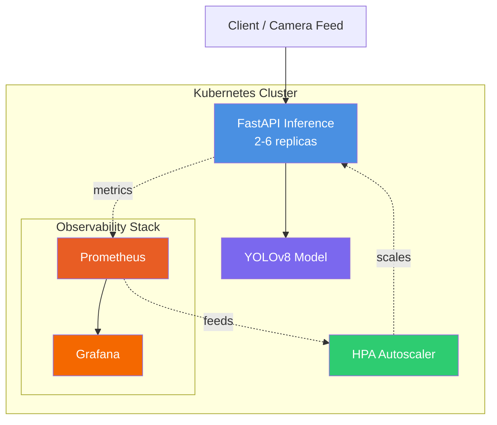

# 🏭 MLOps Defect Detector

**Production-ready ML inference platform for industrial quality control.**
Built on Kubernetes with autoscaling, monitoring, and CI/CD-ready architecture.

🔗 [LinkedIn](https://linkedin.com/in/yusufbender) • [GitHub](https://github.com/yusufbender)

[]()
[]()
[]()
[]()
[]()
[]()
[]()

---

## 💼 What This Project Demonstrates

Designed as a **portfolio project for DevOps & MLOps engineering roles**.
Built end-to-end to show production thinking, not just a toy demo.

### Skills Showcased

🔧 **DevOps & Infrastructure**
- Kubernetes (multi-node clusters, Helm packaging, custom controllers)
- Containerization (Docker, multi-stage builds, security best practices)
- Infrastructure as Code (Terraform — planned)
- CI/CD pipelines (Azure DevOps — planned)
- GitOps deployment (ArgoCD — planned)

📊 **Observability**
- Prometheus metrics (custom counters, histograms, gauges)
- Grafana dashboards (RPS, latency, defect breakdown)
- Liveness/readiness/startup probes

🤖 **MLOps**
- ML model serving (YOLOv8 + PyTorch)
- Model lifecycle (build-time bundling, lazy loading, versioning)
- Inference autoscaling (HPA based on CPU + custom metrics)

💡 **Software Engineering**
- Python 3.12 (FastAPI, async I/O)
- REST API design (health checks, structured logging)
- Production patterns (non-root containers, resource limits, graceful shutdown)

---

## 🎯 Business Context

**Problem:** Manual quality control in manufacturing is slow, inconsistent,
and doesn't scale. A single trained inspector can review ~500 parts/day with
~85% consistency.

**Solution:** ML-based defect detection running on cloud-native infrastructure.
Same inspection in 800ms, scales to thousands of parts/hour, ready for
integration with production line cameras.

**Target industries:** Automotive (Bursa hub — Tofaş, Oyak Renault, Karsan),
textiles, electronics, white goods (Arçelik).

---

## 📸 Live System

> Currently running in a local Kubernetes cluster. Cloud deployment to Azure AKS
> in upcoming phase.
$ curl -X POST -F "file=@part.jpg" http://defect-api/predict
{
"request_id": "a3f2c1d8",
"defective": true,
"defect_type": "scratch",
"confidence": 0.87,
"bbox": [142, 218, 401, 376],
"inference_time_ms": 812
}

**Performance:**
- ✅ 2-pod baseline, auto-scales to 6 under load
- ✅ ~800ms inference latency (CPU-only)
- ✅ Zero-downtime rolling updates
- ✅ Full Prometheus instrumentation

---

## 🏗️ Architecture



---

## ✅ Roadmap

| Phase | Description | Status |
|-------|-------------|--------|
| 1 | Kubernetes foundation + Helm packaging | ✅ Complete |
| 2 | YOLOv8 inference service | ✅ Complete |
| 3 | Prometheus + Grafana + HPA autoscaling | ✅ Complete |
| 4 | Azure DevOps CI/CD pipeline | 🚧 In Progress |
| 5 | ArgoCD GitOps deployment | ⏳ Planned |
| 6 | Terraform + Azure AKS production deploy | ⏳ Planned |
| 7 | MVTec dataset fine-tuning (real defects) | ⏳ Planned |

---

## 🔧 For Engineers — Technical Deep Dive

<details>
<summary><b>Click to expand engineering details</b></summary>

### Stack

| Layer | Technology |
|-------|-----------|
| Orchestration | Kubernetes 1.31 (kind locally, AKS in production) |
| Packaging | Helm 3.20 |
| API | FastAPI 0.115 + Uvicorn |
| Model | YOLOv8n (Ultralytics) + PyTorch 2.4 CPU-only |
| Monitoring | kube-prometheus-stack (Prometheus + Grafana + Operator) |
| Autoscaling | HPA v2 (CPU-based, metrics-server) |

### Key Design Decisions

**Model loaded at startup via FastAPI `lifespan`** — pays ~8s cold start once,
keeps per-request latency at ~800ms instead of seconds.

**Three separate probes (startup/liveness/readiness)** — startup probe gives
65s for model load, liveness checks process, readiness verifies model is loaded
before routing traffic.

**Build-time model download** — Dockerfile bakes the model into the image
during build. No runtime downloads, reproducible builds, immutable artifacts.

**CPU-only PyTorch** — saves ~1.5GB on image size since cluster has no GPU.
GPU is reserved for training (separate workflow).

**Heuristic v1 model** — Phase 2 deliberately uses COCO-pretrained YOLOv8 with
a heuristic to validate the pipeline. MVTec fine-tuning is a separate phase
to decouple infrastructure work from ML work.

### Quick Start

Prerequisites: Docker, kind ≥ 0.24, kubectl ≥ 1.31, Helm ≥ 3.20.

```bash
# Cluster
kind create cluster --config infra/kind-config.yaml

# Build & load image
docker build -f services/inference-api/Dockerfile -t defect-api:0.2.1 .
kind load docker-image defect-api:0.2.1 --name defect-cluster

# Deploy
kubectl create namespace defect-system
helm install defect k8s/defect-api -n defect-system --set image.tag=0.2.1

# Monitoring
helm install kps prometheus-community/kube-prometheus-stack \
  -n monitoring --create-namespace \
  -f infra/kube-prometheus-values.yaml

# Test
kubectl port-forward -n defect-system svc/defect-defect-api 8000:8000
curl http://localhost:8000/ready
```

### Repository Layout

| Path | Purpose |
|------|---------|
| `infra/kind-config.yaml` | 3-node local Kubernetes cluster |
| `infra/kube-prometheus-values.yaml` | Monitoring stack customization |
| `k8s/defect-api/` | Helm chart (Deployment, Service, HPA, ServiceAccount) |
| `services/inference-api/main.py` | FastAPI app — endpoints, lifespan, metrics |
| `services/inference-api/model.py` | `DefectDetector` wrapper around YOLOv8 |
| `services/inference-api/Dockerfile` | CPU-only PyTorch, model baked in, non-root |

### Metrics Exposed

| Metric | Type | Purpose |
|--------|------|---------|
| `inference_requests_total` | Counter | Request volume by endpoint/status |
| `inference_duration_seconds` | Histogram | Latency distribution (p50/p95/p99) |
| `inference_active_requests` | Gauge | Concurrent in-flight requests |
| `defects_detected_total` | Counter | Defect counts by type |
| `model_load_duration_seconds` | Gauge | Time to load model at startup |

</details>

---

## 📝 License

MIT — see [LICENSE](LICENSE).

---
